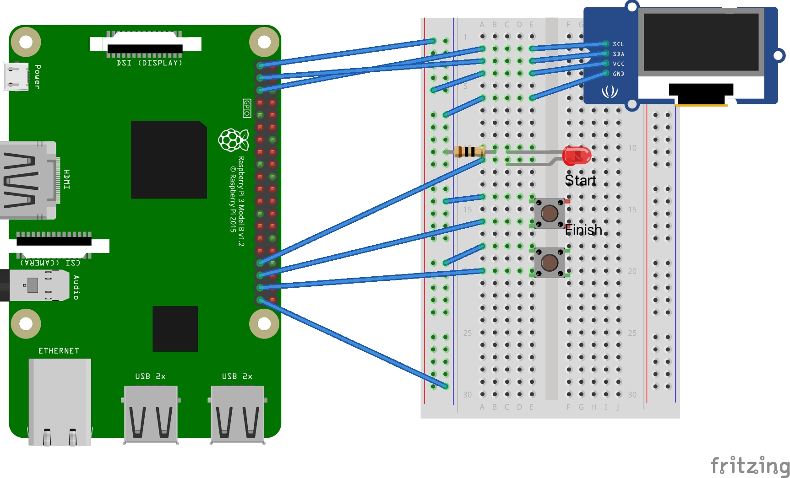

## 動作環境
- `python3.9.2`

### 動作環境構築
```sh
$ pip3 install adafruit-circuitpython-ssd1306
$ sudo apt-get install python3-pil
$ sudo apt-get install python3-numpy
```

### 配線図(ブレッドボード)


### 起動コマンド
```sh
$ python3 python/src/time_attacker.py
```

#### 自動起動設定
1. 以下のファイルを開く
   - `/etc/rc.local`
2. 以下を記載する
   - `sudo -u <ユーザ> python3 <配置場所>/play_with_raspberry_pi/python/src/time_attacker.py &`
